```{r}
#| label: setup
#| include: false

required_packages <- c("resemble")

missing <- required_packages[!sapply(required_packages, requireNamespace, quietly = TRUE)]
if (length(missing) > 0) install.packages(missing)

library(resemble)

knitr::opts_chunk$set(
  echo = TRUE,
  eval = FALSE,
  message = FALSE,
  warning = FALSE, 
  fig.align = 'center'
)
```


## {.title-top background-image="fig/001-spc-001.webp" background-size="contain" background-position="center" background-color="#2B2B2B"}

## {.title-top background-image="fig/001-spc-002.webp" background-size="contain" background-position="center" background-color="#2B2B2B"}

## {.title-top background-image="fig/001-spc-003.webp" background-size="contain" background-position="center" background-color="#2B2B2B"}

## {.title-top background-image="fig/001-spc-004.webp" background-size="contain" background-position="center" background-color="#2B2B2B"}

## {.title-top background-image="fig/001-spc-005.webp" background-size="contain" background-position="center" background-color="#2B2B2B"}

## {.title-top background-image="fig/001-spc-006.webp" background-size="contain" background-position="center" background-color="#2B2B2B"}

## {.title-top background-image="fig/001-spc-007.webp" background-size="contain" background-position="center" background-color="#2B2B2B"}

## {.title-top background-image="fig/001-spc-008.webp" background-size="contain" background-position="center"}


## {.title-top background-image="fig/soil_spectroscopy_framework/Slide1.PNG" background-size="contain" background-position="center" background-color="#2F2F2F"}

## {.title-top background-image="fig/soil_spectroscopy_framework/Slide2.PNG" background-size="contain" background-position="center" background-color="#2F2F2F"}

## {.title-top background-image="fig/soil_spectroscopy_framework/Slide4.PNG" background-size="contain" background-position="center" background-color="#2F2F2F"}

## {.title-top background-image="fig/soil_spectroscopy_framework/Slide10.PNG" background-size="contain" background-position="center" background-color="#2F2F2F"}

## {.title-top background-image="fig/soil_spectroscopy_hits_2026-09-06.png" background-size="contain" background-position="center" background-color="#2B2B2B"}


## {.title-top background-image="fig/soil_spectroscopy_framework/Slide4.PNG" background-size="contain" background-position="center" background-color="#2F2F2F"}

## {.title-top background-image="fig/soil_spectroscopy_framework/Slide11.PNG" background-size="contain" background-position="center" background-color="#2F2F2F"}

## {.title-top background-image="fig/soil_spectroscopy_framework/Slide12.PNG" background-size="contain" background-position="center" background-color="#2F2F2F"}

## {.title-top background-image="fig/soil_spectroscopy_framework/Slide13.PNG" background-size="contain" background-position="center" background-color="#2F2F2F"}


## Example of soil spectroscopy for mapping [1/2]

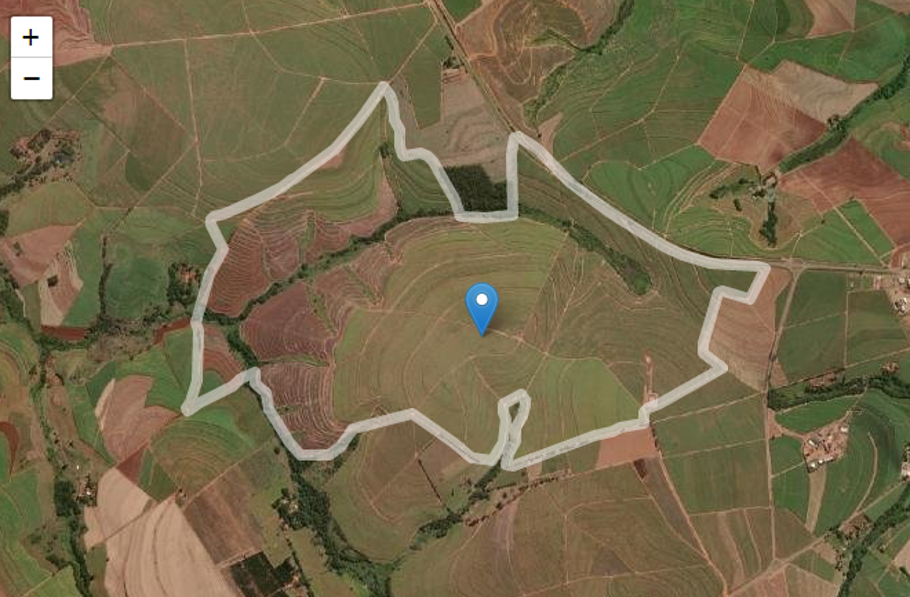{fig-align="center" height="400px"}


## Example of soil spectroscopy for mapping [1/2]

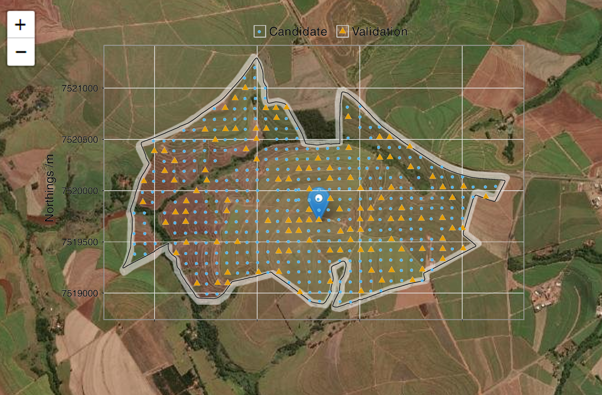{fig-align="center" height="400px"}

## Example of soil spectroscopy for mapping [1/2]

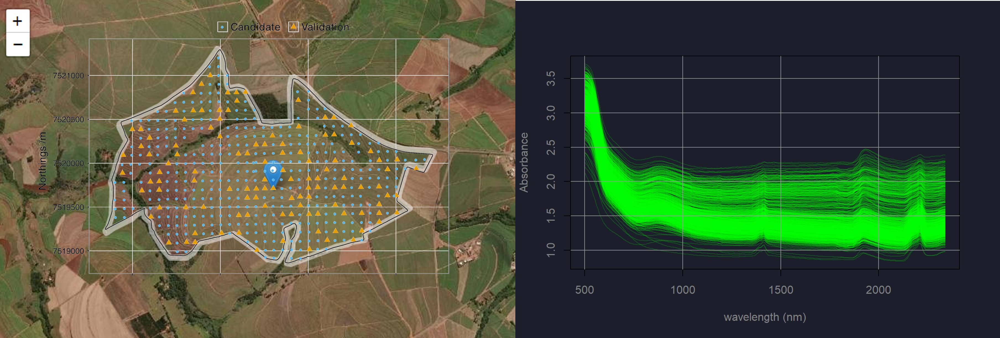{fig-align="center"}


## Example of soil spectroscopy for mapping [1/2]

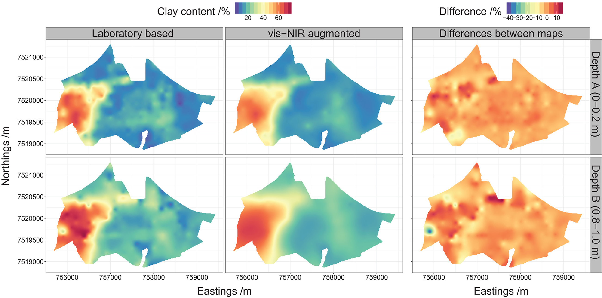{fig-align="center"}

## Example of soil spectroscopy for mapping [2/2]  

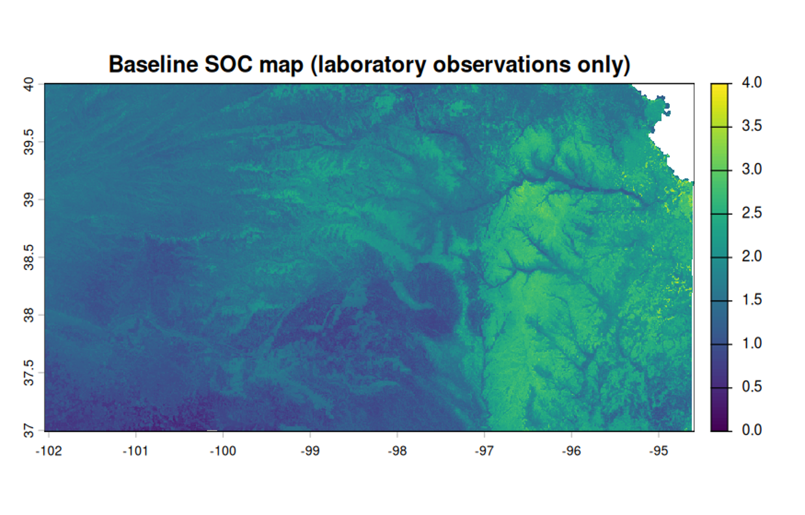{fig-align="center"}  


## Example of soil spectroscopy for mapping [2/2]  

```{r}
#| echo: false
#| message: false
#| warning: false
#| eval: true
#| out-width: "35%"

library(plotly)

soc_val <- readRDS("fig/kansas_val_plot.rds")
dat_cal <- readRDS("fig/kansas_val_plot_dat_cal.rds")
xy_lims <- range(dat_cal$SOC_predRF, dat_cal$SOC)
plot_ly() |>
  # Error bars (horizontal: ±1 SD on predicted SOC)
  add_segments(
    x = dat_cal$SOC_predRF - dat_cal$SOC_sdRF,
    xend = dat_cal$SOC_predRF + dat_cal$SOC_sdRF,
    y = dat_cal$SOC,
    yend = dat_cal$SOC,
    line = list(color = "rgba(51, 115, 179, 0.35)", width = 1.5),
    hoverinfo = "skip",
    showlegend = FALSE
  ) |>
  # 1:1 reference line
  add_segments(
    x = xy_lims[1], xend = xy_lims[2],
    y = xy_lims[1], yend = xy_lims[2],
    line = list(color = "rgba(128, 128, 128, 0.9)", width = 1.5, dash = "dash"),
    hoverinfo = "skip",
    name = "1:1 line",
    showlegend = FALSE
  ) |>
  # Predicted vs measured points
  add_markers(
    x = dat_cal$SOC_predRF,
    y = dat_cal$SOC,
    marker = list(
      color = "rgba(38, 38, 38, 0.75)",
      size = 8
    ),
    text = ~paste0(
      "Predicted SOC: ", round(dat_cal$SOC_predRF, 2), "%<br>",
      "Measured SOC: ", round(dat_cal$SOC, 2), "%<br>",
      "Prediction SD: ", round(dat_cal$SOC_sdRF, 2), "%"
    ),
    hoverinfo = "text",
    showlegend = FALSE
  ) |>
  layout(
    xaxis = list(
      title = "Predicted SOC (%)",
      range = xy_lims,
      gridcolor = "rgba(204, 204, 204, 0.6)",
      zeroline = FALSE
    ),
    yaxis = list(
      title = "Measured SOC (%)",
      range = xy_lims,
      gridcolor = "rgba(204, 204, 204, 0.6)",
      zeroline = FALSE,
      scaleanchor = "x",  # forces equal aspect ratio
      scaleratio = 1
    ),
    plot_bgcolor = "white",
    paper_bgcolor = "white"
  )
```


## Example of soil spectroscopy for mapping [2/2]

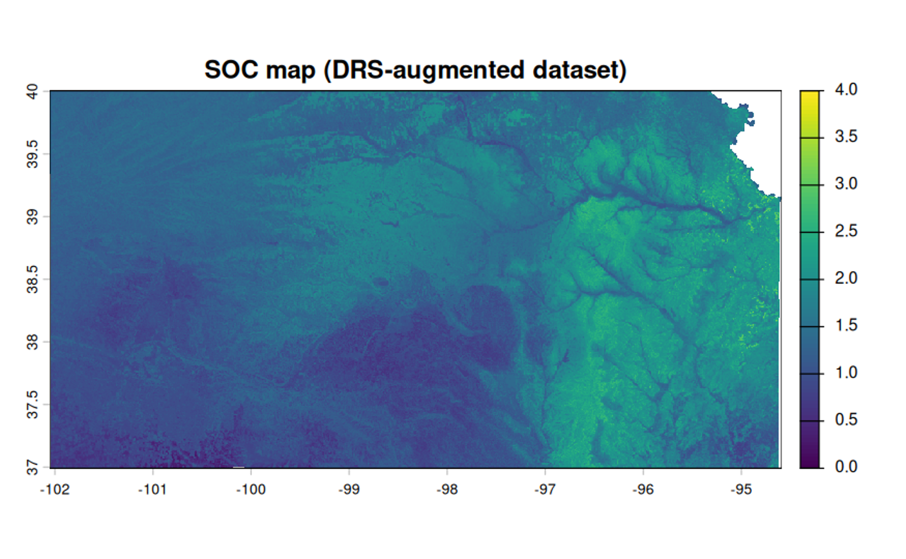{fig-align="center"}

## Example of soil spectroscopy for mapping [2/2]

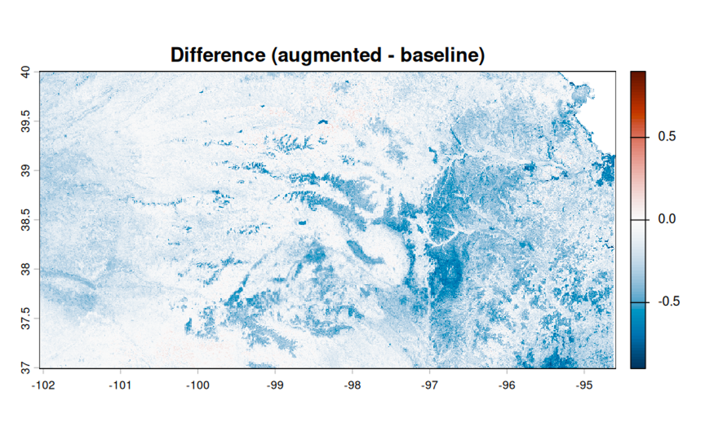{fig-align="center"}


## {.title-top background-image="fig/soil_spectroscopy_hits_2026-09-06.png" background-size="contain" background-position="center" background-color="#2B2B2B"}


## Is soil spectroscopy cheap and fast? {background-color="#000000"}

mmmmm...

## Is soil spectroscopy cheap and fast? {background-color="#000000"}

mmmmmmmmmm...

## Is soil spectroscopy cheap and fast? {background-color="#000000"}

mmmmmmmmmmmmmmm... yeah but bot really

## Is soil spectroscopy cheap and fast? {background-color="#000000"}

::: {.incremental}

[__Implementation__]{style="color:#D9A404;"}: It can be expensive

- Hardware and software costs  

- Cost of reference analyses  

- Elevated time investments  

- People  

::: 


## Is soil spectroscopy cheap and fast? {background-color="#000000"}

::: {.incremental}

[__Routine analysis__]{style="color:#D9A404;"}: It can boost the efficiency of your lab

- Reduces the need for conventional methods  

- A sample is measured in a matter of seconds  

- Requires periodic validation and model updates

::: 


## Soil spectral libraries (valuable resources for soil mapping)

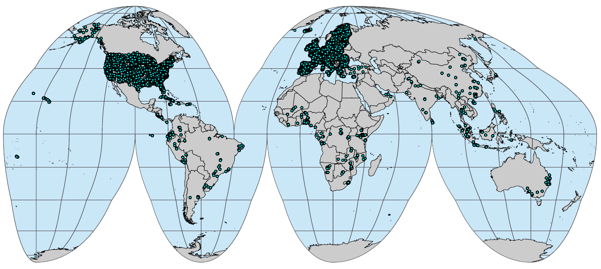{fig-align="center"}

::: footer
Source: [soilspectroscopy.org/ossl-updates](https://soilspectroscopy.org/ossl-updates/)
:::


## `liblex`


<p style="text-align:center;">Library of local experts</p>

## Background

@ramirez2026spectral

<div class="pdf-embed">
  <iframe
    src="fig/liblex-paper.pdf#toolbar=0&navpanes=0"
    width="100%"
    height="900"
    style="border: none;">
  </iframe>
</div>


## An experiment [1/2]...

A __soil__ IR spectral library from the North America [@hengl2021ossl]  

Open source

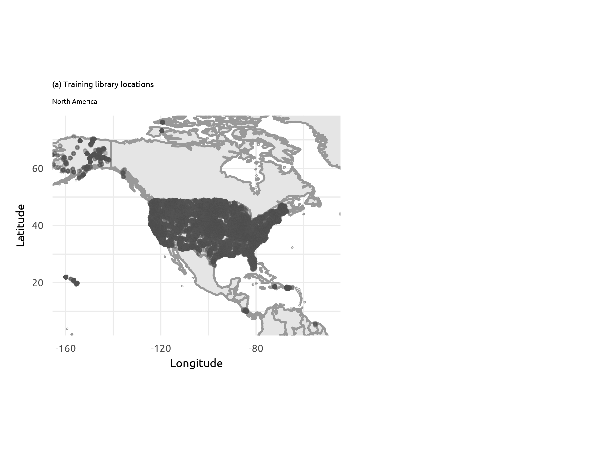


## An experiment [2/2]...

A __soil__ IR  spectral dataset from our target domain [@summerauer2021central]

__Target__ $y$: Total carbon

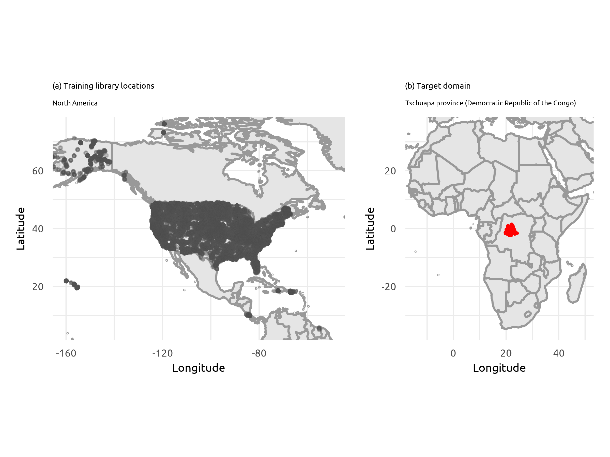


## Which anchors gave birth to our relevant experts?


## Validation with independent samples...


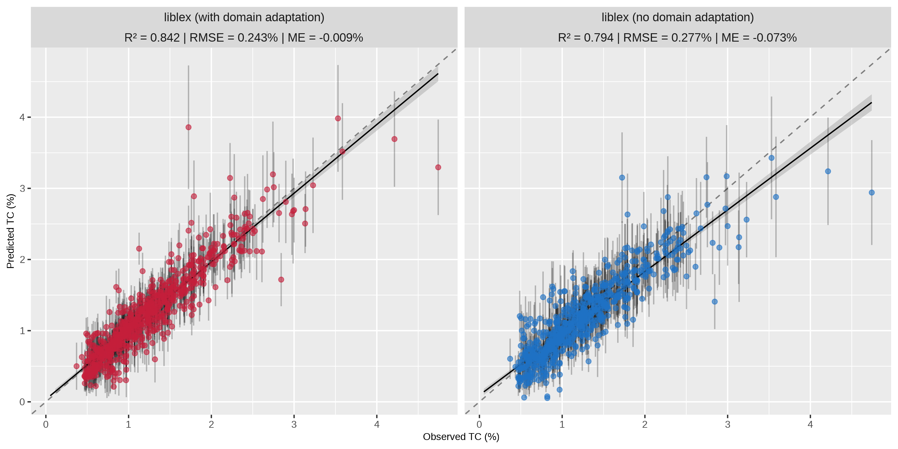


## Scaling soil spectroscopy {background-color="#000000"}

::: {.incremental}

- __Short term__: Learn and adjust

- __Mid term__: Move to modest amount of samples processed with NIR/IR

- __Long term__: Make it fully operational for your properties and move to a significant amount of samples processed with NIR/IR
::: 


## {.title-top background-image="fig/augmented-ai-framework.png" background-size="contain" background-position="center"}


## Open-source implementation...{background-color="#000000"}

[since 2013]


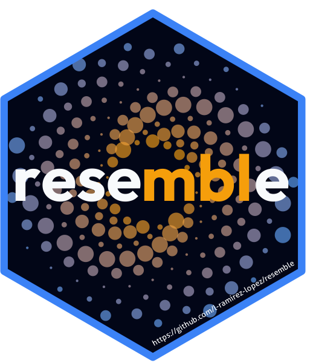

[https://cran.r-project.org/package=resemble](https://cran.r-project.org/package=resemble)
```{r}
#| eval: false
liblex()
```

## Open-source implementations... {background-color="#000000"}

[since 2013]


[https://cran.r-project.org/package=resemble](https://cran.r-project.org/package=resemble)


## Perspectives {background-color="#000000"}

::: {.incremental}

- [__Accuracy is no longer the bottleneck__]{style="color:#D9A404;"}: implementation is

- [__Routine use is a lifecycle, not a model__]{style="color:#D9A404;"}: applicability domain, drift monitoring, revalidation, retirement

- [__Triage the properties__]{style="color:#D9A404;"}: operationally ready, under research, or high risk of low reward

- [__Standardise__]{style="color:#D9A404;"}: feed and milk NIR have had ISO methods for years; soil has none

- [__Integrate in phases__]{style="color:#D9A404;"}: 90/10, then 80/20, then 70/30. Not substitution

:::

# <span style="font-size: 1.8em; display: flex; justify-content: center;">Peace</span> {background-color="#000000"}

This presentation: 

```{r}
#| echo: false
#| eval: true
#| fig-align: center
#| fig-width: 3
#| fig-height: 3
library(qrcode)
plot(qr_code("https://l-ramirez-lopez.github.io/cac-2026-presentation/"))
```


## {background-color="#A0522D"}

::: {.large-text}
__📢 WORKSHOP ANNOUNCEMENT!__ 
::: 

___Applied NIR spectroscopy: from theory to calibration and instrumentation___

Join us at North Carolina State University (NCSU), Raleigh, NC, from 9$^{th}$ to 11$^{th}$ November 2026!

::: {.small-text2}
___Organisers___: Miguel Castillo (NCSU), Juan José Acosta (Camcore), Marçal Plans (BÜCHI) and Leonardo Ramirez-Lopez (BÜCHI)
::: 

::: {.small-text3}
This presentation: 
::: 

```{r}
#| echo: false
#| eval: true
#| fig-align: left
#| fig-width: 2
#| fig-height: 2
#| label: qr-code
library(qrcode)
my_qr <- qr_code("https://l-ramirez-lopez.github.io/idrc-2026-presentation/")
plot(my_qr)
```


## References


